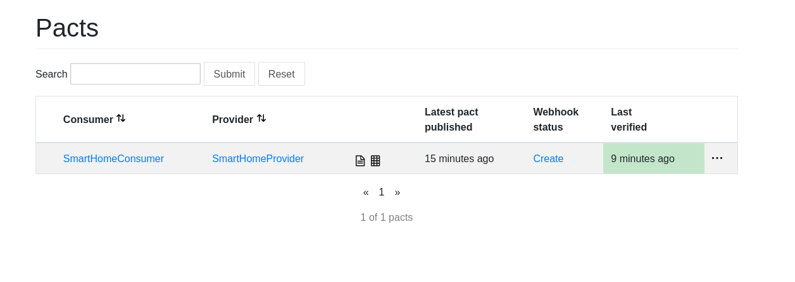

# Consumer Driven Contract Testing

This directory contains the consumer driven contract tests for the api. The tests are written in PHP and use the [Pact](https://github.com/pact-foundation/pact-php) library to generate and verify the contracts.

## What is Consumer Driven Contract Testing?

Consumer Driven Contract testing is a technique to define the interactions between the consumer and provider in a contract. The consumer defines the contract by writing tests that describe the expected interactions with the provider. The provider then verifies that the contract is satisfied by running the tests against their API.

## Why use Consumer Driven Contract Testing?

Consumer Driven Contract testing has several benefits over traditional API testing techniques.

* **Less brittle tests**: The tests are written in terms of the consumer's expectations, so if the provider changes their API, the tests will fail in a way that is easy to understand.
* **More comprehensive coverage**: By writing tests for the expected interactions, the consumer can ensure that the contract is comprehensive and covers all the required scenarios.
* **Improved communication**: The contract provides a clear and unambiguous description of the expected interactions, which can help to improve communication between the consumer and provider teams.

## Running the tests

To run the tests, you will need to open the project in a VSCode editor with DevContainers enabled. This will set up the required environment for the project. Once the DevContainer is running, you can execute the test command to run the tests.

    composer test

This will run all the tests in the `tests` directory and verify that the contracts are satisfied.

## Testing the interaction with a Pact Broker Server

A Pact Broker server is a service that is used to store and verify the contracts between the consumer and provider. It is a central location where the contracts are stored and can be accessed by the consumer and provider teams.

Once the tests have been run, the contracts are verified against the Pact Broker server. To do this, you can run the following command:

    composer pact-publish

This will publish the contracts to the Pact Broker server. The interface for the Pact Broker server is available at [http://127.0.0.1:9292](http://127.0.0.1:9292). You can access this interface to view the contracts and verify that they are satisfied.

## Result on the Pact Broker dashboard

When the pact is published and verified, the interface on the Pact Broker server will look like this:

The dashboard shows the contracts between the consumer and the provider. The contracts are listed in the main table, and the current status of the contracts is shown in the summary at the top of the page. The summary shows the number of contracts that are verified, the number of contracts that are not verified, and the number of contracts that are pending verification. The contracts are grouped by the provider and the consumer, and the dashboard provides a filter to select the contracts by provider or consumer. Each contract is listed in a table with the provider and consumer names, and the current status of the contract. The status of the contract can be one of the following:
- `Verified`: The contract is verified and the provider has confirmed that the contract is satisfied.
- `Not Verified`: The contract is not verified and the provider has not confirmed that the contract is satisfied.
- `Pending Verification`: The contract is pending verification and the provider has not yet confirmed that the contract is satisfied.
